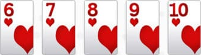
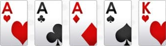
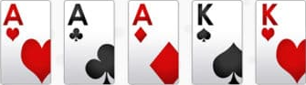
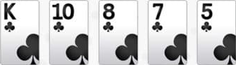
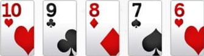
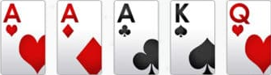
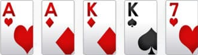
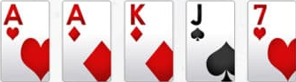
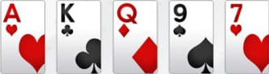

# Poker Hand Evaluation with Machine Learning

## Table of Contents
- [Objectives](#objectives)
- [Texas Hold'em Rules](#texas-holdem-rules)
- [Data Representation](#data-representation)
- [Data Creation](#data-creation)
- [Classification of Hands](#classification-of-hands)
- [Rating of Hands](#rating-of-hands)

---

## Objectives
The primary goal of this project is to develop a machine learning model capable of evaluating and comparing poker hands in Texas Hold'em on two criteria : a note and a confiance value.

### Steps to achieve this:
1. **Data Representation**: Define an efficient encoding for poker hands (cards' rank and suit).
2. **Data Creation**: Generate labeled datasets for training the model.
3. **Hand Classification**: Train a model to classify poker hands statistics.
4. **Hand Rating**: Implement a system to compare and rate the relative strength of two hands.
   
## Texas Hold'em Rules
In Texas Hold'em, each player is dealt two private cards (known as "hole cards"), and five community cards are dealt face-up on the table in three stages (the flop, turn, and river). Players aim to form the best possible five-card hand using any combination of their two hole cards and the five community cards. Hands may be composed of a mix of private and community cards, and sometimes a player's hand may not be complete until all community cards are revealed.

### Possible Hands (ranked from strongest to weakest):
<table>
<tr>
<td width="50%" valign="top">

### Straight Flush
  
Five consecutive cards of the same suit.

### Four of a Kind
  
Four cards of the same rank.

### Full House
  
Three of a kind plus a pair.

### Flush
  
Five cards of the same suit, not in sequence.

### Straight
  
Five consecutive cards, different suits.

</td>
<td style="border-left: 1px solid black;" width="50%" valign="top">

### Three of a Kind
  
Three cards of the same rank.

### Two Pair
  
Two cards of one rank and two cards of another rank.

### One Pair
  
Two cards of the same rank.

### High Card
  
When no other hand is made, the highest card plays.

</td>
</tr>
</table>

Expl

## Data Representation

## Data Creation

## Classification of Hands

## Rating of Hands
