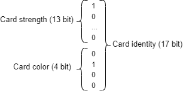
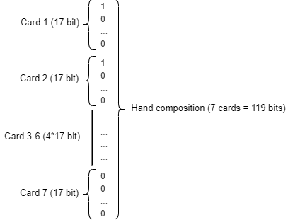

# Poker Hand Evaluation with Machine Learning

## Table of Contents
- [Objectives](#objectives)
- [Texas Hold'em Rules](#texas-holdem-rules)
- [Data Representation](#data-representation)
- [Data Creation](#data-creation)
- [Classification of Hands](#classification-of-hands)
- [Rating of Hands](#rating-of-hands)

---

## Objectives
The primary goal of this project is to develop a machine learning model capable of evaluating and comparing poker hands in Texas Hold'em on two criteria : a note and a confiance value.

### Steps to achieve this:
1. **Data Representation**: Define an efficient encoding for poker hands (cards' rank and suit).
2. **Data Creation**: Generate labeled datasets for training the model.
3. **Hand Classification**: Train a model to classify poker hands statistics.
4. **Hand Rating**: Implement a system to compare and rate the relative strength of two hands.
   
## Texas Hold'em Rules
In Texas Hold'em, each player is dealt two private cards (known as "hole cards"), and five community cards are dealt face-up on the table in three stages (the flop, turn, and river). Players aim to form the best possible five-card hand using any combination of their two hole cards and the five community cards. Hands may be composed of a mix of private and community cards, and sometimes a player's hand may not be complete until all community cards are revealed.

### Possible Hands (ranked from strongest to weakest):
<table>
<tr>
<td width="50%" valign="top">

### Straight Flush
  
Five consecutive cards of the same suit.

### Four of a Kind
  
Four cards of the same rank.

### Full House
  
Three of a kind plus a pair.

### Flush
  
Five cards of the same suit, not in sequence.

### Straight
  
Five consecutive cards, different suits.

</td>
<td style="border-left: 1px solid black;" width="50%" valign="top">

### Three of a Kind
  
Three cards of the same rank.

### Two Pair
  
Two cards of one rank and two cards of another rank.

### One Pair
  
Two cards of the same rank.

### High Card
  
When no other hand is made, the highest card plays.

</td>
</tr>
</table>

Expl

## Data Representation

The first step is to describe a card using a vector. I chose to use a combination of two one-hot encodings: one for the card rank (2 to Ace) and one for the card suit. (Heart, diamond, spade, club)  

  
   
  <i>Figure 1: Representation of a single card</i>

As we can see on figure 1, each card is represented with 17 bits.   
This encoding is efficient because the combination of rank and suit is rarely relevant at the same time in most hands (either the rank is important for combinations like pairs or straights, or the suit is important for flushes, but both are only necessary together in a straight flush, which has just a 0.0279% chance of occurring for a given player).

A binary representation of a card could take only 6 bits but for such a low dimention vector, simplicity is better than dencity.  
  
We will then concatenate multiple cards to make a hand. Each hand is composed of 7 cards, but some of them can be null. We want to train the network on non-full hands. The firts two cards are always here (and will always be on the first 34 bits) to represent the two cards in hand. The five following cards can be present or absent (leaving 17 zeroes) representing communities cards. The order of the five cards is random and any of them can be null.   

  
   
  <i>Figure 2: Representation of a hand</i>

## Labelisation

For the first network, we will use supervised learning. The first objective is to determine the probability of each hand given a set of cards.
Each of the 9 possible hands is accompagned by 0, 1 or 2 strength factor.
For exemple :  
- A flush (🂡🂤🂧🂨🂩) is equal to another, regardless of the value of the cards  
- A Three of a kind (🂱🃁🃑🂹🂬) is defined by the value of 1 card (here the ace)   
- A Two pair (🂱🃁🂩🂹🂬) is defined by the values of 2 cards (here ace and nine)  
For each possible combinaison, we will only look after the most probable event, then for most valuable event if some are equiprobable.  
For exemple :

Given the following cards : 🂱🂨🂩🂹🂬 and evaluating the probability of a three of a kind with the next two following cards.
It is possible that the last two cards are aces (~2.7%) is less probable than at least an 9 (~8.4%).
We will then keep the probability p = 0.084 and the strength 9 (encoded on 13 bits one-hot vector) 

Given the following cards : 🂱🂱🂩🂹🂬 and evaluating the probability of a three of a kind with the next two following cards.
This time, the probability of at least one Ace or the probability of at least one 9 are equal. We will then keep the one with the better value (here the Ace)

| Hand            | Number of value indicator | Encoding | Total dimension |
|-----------------|---------------------------|----------|-----------------|
| Straight Flush  | 1                         | 1 probability indicator (1 float)   1 value indicator (13 bit)| Dim = 14 |
| Four of a Kind  | 1                         | 1 probability indicator (1 float)   1 value indicator (13 bit)| Dim = 14|
| Full House      | 2                         | 1 probability indicator (1 float)   2 value indicator (26 bit)| Dim = 27 |
| Flush           | 0                         | 1 probability indicator (1 float) | Dim = 1 |
| Straight        | 1                         | 1 probability indicator (1 float)   1 value indicator (13 bit)| Dim = 14|
| Three of a Kind | 1                         | 1 probability indicator (1 float)   1 value indicator (13 bit)| Dim = 14|
| Two Pair        | 2                         | 1 probability indicator (1 float)   2 value indicator (26 bit)| Dim = 27|
| One Pair        | 1                         | 1 probability indicator (1 float)   1 value indicator (13 bit)| Dim = 14|
| High Card       | 1                         | 1 probability indicator (1 float)   1 value indicator (13 bit)| Dim = 14|  

However, one set of thoses probabilities isn't enought. 

## Data Creation

## Classification of Hands

## Rating of Hands
